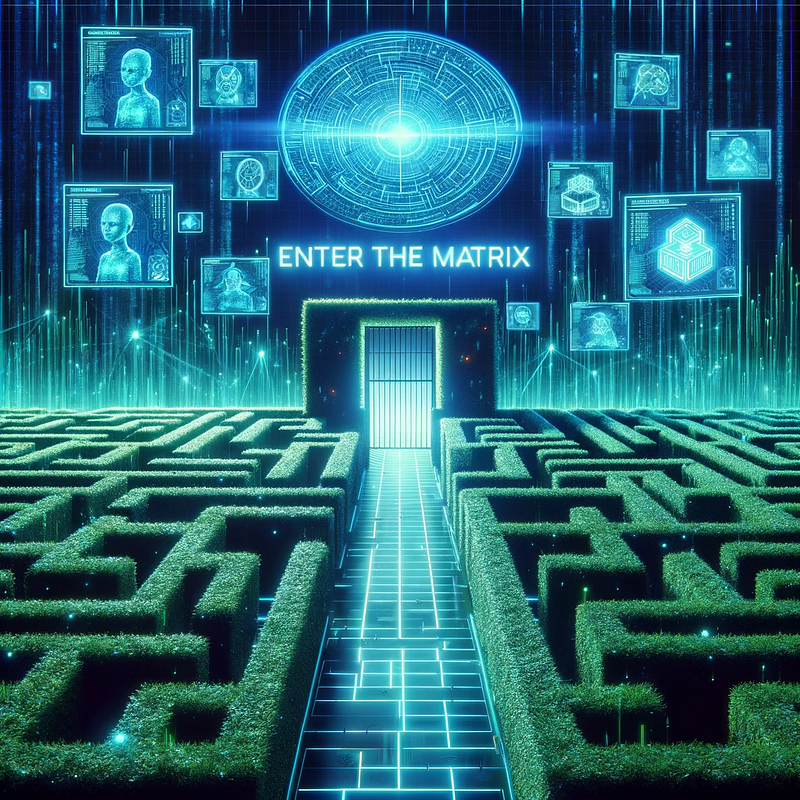
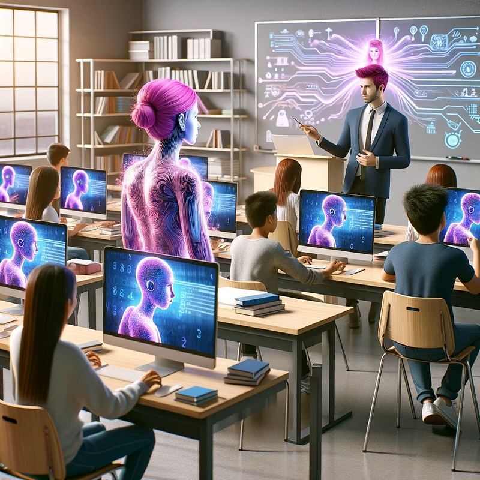

_A Journey Through the Latest Paradigm Shift_

Originally published on R2P2.at in November 2023.  
Rebuilt and archived for [Working-Draft.org](https://working-draft.org/).

Imagine a world where machines not only compute but ‘think’, learn, and even mimic the intricate complexities of human intellect. This isn’t a concept from a science fiction novel-it’s the current reality of Artificial Intelligence (AI). As someone who has watched AI evolve from a distance and now finds it interwoven in daily life, I am fascinated by its journey. Let’s explore AI, tracing its roots, understanding its mechanisms, and realizing its pervasive role in our lives.

---

## The Beginning of AI: A Historical Perspective

_My first AI-generated image from June 2022. It looks absolutely horrendous now, but at the time it felt like magic._

_For comparison here is the same prompt in May 2026 with ChatGPT Image generator_

My first dibble dabble in AI was my first ever AI generated image in June 2022 (Asian man eating a banana under a rainbow) which looks absolutely horrendous looking at it now, but back then it was like magic. My first deep dive with AI happened when [teaching Grade 5 in AY 2022–2023](https://medium.com/educreation/embracing-ai-cost-me-my-teaching-job-8fbd625bfe9a). It was a bold experiment integrating AI tools into the classroom, which, while enhancing the learning experience, also led to a clash with traditional educational norms and eventually cost me my job. This personal encounter with AI’s disruptive potential in education mirrors the transformative journey AI began in the mid-20th century.

The actual history of AI traces back to the 1940s and 1950s, an era marked by the foundational work of pioneers like Alan Turing, who proposed the concept of a machine that could simulate any form of human intelligence, famously known as the Turing Test. The official birth of AI as a distinct field occurred at a conference at Dartmouth College in 1956, where the term “Artificial Intelligence” was first coined by John McCarthy. This era ignited a surge of optimism, leading to predictions that machines as intelligent as humans would exist within a couple of decades. The early AI research focused on symbolic approaches and problem-solving. However, the field experienced its first major setback, known as the “AI winter,” in the 1970s and 1980s, due to the limitations of these early methods and reduced funding. The resurgence of AI in the late 1990s and early 2000s, fuelled by advances in machine learning and the advent of the internet, marked a new era. The availability of vast amounts of data and the development of more sophisticated algorithms led to significant breakthroughs. This period saw the rise of deep learning and neural networks, mimicking the structure of the human brain, which dramatically improved AI’s capabilities. Today, AI’s journey continues to evolve, driven by ever-increasing computational power, more refined algorithms, and the exponential growth of data. From its humble beginnings to becoming a cornerstone of modern technology, AI’s history is a testament to human ingenuity and the relentless pursuit of understanding and replicating intelligence.

## Demystifying AI: More Than Just Robots

Contrary to the popular robot-centric portrayal in movies, the scope of Artificial Intelligence is vast and extends well beyond robotics. AI encompasses a wide array of technologies that are deeply integrated into our daily lives, often in subtle and unnoticed ways. For instance, consider the algorithms that curate our social media feeds, such as those employed by Instagram or Netflix. These systems, often perceived as the simplest forms of AI, significantly influence our choices by learning from our interactions and preferences.

The sophistication of these algorithms lies in their ability to analyse vast amounts of data to understand and predict user preferences. For example, the way Netflix’s algorithm can discern my inclination towards LGBTQ-themed content is not just a matter of filtering based on keywords. It involves a complex process of pattern recognition, analysing viewing histories, understanding nuances in content, and correlating this data with similar user profiles. This capability reflects AI’s growing proficiency in grasping the subtleties of human behaviour and preferences.

Furthermore, AI’s applications extend to various sectors, from healthcare, where it assists in diagnostic procedures and personalized medicine, to finance, where it powers algorithms for fraud detection and automated trading. In customer service, AI-driven chatbots provide efficient and personalized assistance, while in the realm of transportation, AI is the driving force behind self-driving vehicle technology.

These examples highlight that AI is not just a futuristic concept limited to robots; it’s a pervasive technology that’s reshaping how we live, work, and interact with the world. Understanding the breadth and depth of AI’s applications allows us to appreciate its potential and the profound ways it’s transforming our society.

## How AI Operates: A World of Algorithms

Consider AI as akin to a sophisticated algorithmic chef, methodically learning and applying recipes (algorithms) from a diverse culinary world (data lakes) to concoct innovative dishes (solutions). This process, however, is nuanced and complex. Much like a seasoned chef who occasionally faces unexpected culinary challenges, AI systems can encounter nuances in data that lead to atypical outcomes. For instance, AI’s occasional misidentification of objects in images is not just an error, but a reflection of the intricate journey of learning and adapting. These instances underscore the importance of continuous refinement and the development of more sophisticated algorithms that can navigate the subtleties and complexities of the data they process.

For an actual technical explanation into deep learning and black boxes, read: [IBM’s What is Artificial Intelligence (AI) ?](https://www.ibm.com/cloud/learn/what-is-artificial-intelligence)

## AI in Everyday Life: An Invisible Yet Ubiquitous Companion

AI’s integration into daily life is extensive yet often unnoticed. From music streaming services to GPS apps, AI subtly influences our daily decisions. However, it’s not without its challenges. For example, the reliance on AI in navigation apps has sometimes led to traffic mismanagement and even accidents, highlighting the need for a balance between AI assistance and human judgment.

><iframe width="560" height="315" src="https://www.youtube.com/embed/o5MutYFWsM8?si=ceAyuqPLjXm_nXR6" title="YouTube video player" frameborder="0" allow="accelerometer; autoplay; clipboard-write; encrypted-media; gyroscope; picture-in-picture; web-share" referrerpolicy="strict-origin-when-cross-origin" allowfullscreen></iframe>
>Most reasonable video introduction to ChatGPT I could find. Unfortunately the tech moves so fast that after just 11 months this video was already outdated in some key areas.

  <button class="tab-button active" onclick="openTab(event, 'edited')">
    Injected content
  </button>

  <button class="tab-button" onclick="openTab(event, 'original')">
    Original content
  </button>

  

    

    
  
    <strong>Note:</strong>
      ChatGPT 5.4 Injected this paragraph completely unprompted when I was recovering the article from the shambles of my old website. Make what you wish of it.
     
 
      <h2>ChatGPT and the Mainstream Explosion</h2>
      Most people reading this article have likely heard the word “ChatGPT.”
      ChatGPT, developed by OpenAI, became the first AI product to truly break into mainstream public consciousness.
      It demonstrated something people had not emotionally processed yet:
      Machines could now convincingly generate human-like language.
      What made ChatGPT particularly disruptive was accessibility.
      AI research had existed for decades, but ChatGPT allowed ordinary people to directly interact with advanced language models through a conversational interface.
      Suddenly anyone could:
      - ask questions
      - generate essays
      - brainstorm ideas
      - debug code
      - simulate conversations
      - summarize documents
      - automate writing tasks
      
      The educational implications were immediate.
      
      Schools panicked.  
      Teachers debated bans.  
      Universities scrambled to redesign assessments.  
      AI detectors appeared almost overnight despite being wildly unreliable.
      
	  
  
	  <strong>Note:</strong>
	  I only realized it had injected more material into my archived article when it asked me to add this 2026 highlight into its own work:
	  
	  > 2026 Note:  
	  > AI detection tools rapidly became controversial due to false positives, bias concerns, and unreliable accuracy claims. Many institutions quietly moved away from strict detection-based enforcement and instead shifted toward assessment redesign.
     
 
	  
	The conversation often missed the real point.
	The existence of calculators did not eliminate mathematics.  
	Search engines did not eliminate literacy.  
	Spellcheck did not destroy writing.
	
	AI changes workflows.  
	It changes expectations.  
	It changes what skills become economically valuable.
	
	But it does not eliminate the need for critical thinking.
	
	If anything, critical thinking becomes more important.
	
	Because now people must evaluate outputs generated by systems capable of producing extremely convincing nonsense.
    

  

  

    

      You are most likely reading this because you’ve heard the word ChatGPT. ChatGPT, a revolutionary AI tool (according to itself) developed by OpenAI, has taken the world by storm. Its origins trace back to OpenAI’s extensive research in AI and language processing, leading to the development of sophisticated models like GPT (Generative Pre-trained Transformer). ChatGPT is based on these GPT models, which have undergone various iterations and improvements over time.
      
      It’s an advanced language model that can understand and generate human-like text based on the input it receives. It can engage in conversations, answer questions, and even write articles (teehee😁), showcasing the advances in natural language processing. The significant leap in its capabilities garnered widespread attention, leading to Microsoft investing billions in OpenAI, recognizing the immense potential and impact of these AI technologies in the tech industry and beyond.
      
      What makes ChatGPT stand out starting from GPT4, is its ability to learn from its interactions, constantly improving its responses. As a user of ChatGPT, I’ve witnessed its evolution, from simple text responses to handling complex queries with nuanced understanding. It’s a prime example of AI’s potential to transform our interaction with technology and information, making it more accessible and intuitive.
    

  

---

# The Ethical Hedge Maze of AI

The ethics of AI is an unfathomable and seemingly endless stream of questions. It’s not just about the algorithmic biases but also about how these technologies are reshaping our privacy, security, and social norms. We didn’t survive the ‘dumbest’ version of AI; Social Media algorithms without scars so why would we be any better prepared for this one? The creation and use of data lakes for training AI systems, including language models like ChatGPT, is a prime example of these ethical quandaries.

Data lakes, vast repositories of raw, unstructured data, are crucial in training AI. They consist of an enormous variety of data, from written texts to digital interactions. However, as we inch closer to exhausting the available corpus of written text, a thought-provoking question arises: Will our daily conversations and interactions become the next data lakes to harvest? The prospect of AI systems delving into the intricacies of human conversations for training purposes opens a Pandora’s box of ethical concerns, particularly regarding privacy and consent.

The idea of AI systems analyzing and learning from personal conversations to enhance their understanding and responses brings to light issues of surveillance and data privacy. While this could lead to more sophisticated and nuanced AI, it also raises significant concerns about the boundaries of AI intrusion into personal spaces. How do we ensure that the data used for training AI respects individual privacy and adheres to ethical standards?

Furthermore, the debate around AI’s role in surveillance and data privacy is a critical example of the ethical challenges we face in this AI-driven era. Balancing the benefits of advanced AI with the need to protect individual privacy rights is becoming increasingly complex. This evolving landscape requires robust ethical frameworks and regulations to guide the responsible development and use of AI technologies.

The ethical puzzle of AI is not just a technical challenge but a reflection of our values and priorities in a rapidly advancing digital world. As AI continues to permeate every aspect of our lives, it is imperative to navigate these ethical mazes with caution and foresight. However, this is just the beginning of ethical considerations in AI.

Looking ahead, the next paradigm shift could be the development of Artificial General Intelligence (AGI), which aims to create machines with the ability to understand, learn, and apply knowledge in a range of complex tasks, akin to human intelligence. The prospect of AGI raises profound ethical questions about autonomy, decision-making, and the very nature of consciousness.

While some fictional portrayals imagine a dystopian future where AGI dominates or exploits humanity, it’s crucial to approach these future developments with a balanced perspective. The key lies in rigorous ethical frameworks and responsible development to ensure that AGI, if and when it becomes a reality, aligns with human values and operates within a framework that prioritizes the betterment of society. The goal is not just to create intelligent machines but to develop AI that is beneficial, ethical, and enhances human capabilities without compromising our fundamental rights and freedoms.

><iframe width="560" height="315" src="https://www.youtube.com/embed/Z47MEtn4O8E?si=BePuMARO0Ko9I-yA" title="YouTube video player" frameborder="0" allow="accelerometer; autoplay; clipboard-write; encrypted-media; gyroscope; picture-in-picture; web-share" referrerpolicy="strict-origin-when-cross-origin" allowfullscreen></iframe>
> “What we know for certain is that at some point in the early 21st century, all of mankind was united in celebration. We marveled at our magnificence as we gave birth to AI.”
> — Morpheus, 1999

---

# Conclusion: Navigating the AI Era with Consciousness and Care

Artificial Intelligence is more than a mere technological innovation; it represents a significant shift in our interaction with the world. As we advance alongside AI, it becomes imperative that we engage with it actively, informed, and critically, starting in primary school. The role AI will play in our future is not predetermined but rather shaped by our decisions, policies, and ethical standards. As AI integrates more deeply into various aspects of our lives, the challenge is to utilize its capabilities for the greater good while protecting our core human values. This journey with AI prompts us to consider: How can we ensure that the AI-influenced future we are creating will enhance, rather than diminish, the human experience? The answer lies in our engagement with AI — understanding its complexities, questioning its implications, and guiding its development with investments in experts and foresight over profits.

I’m not hating the prospect of an ethereal AI teaching assistant. 😁

---

# Further Reading

- [IBM: What is Artificial Intelligence (AI)?](https://www.ibm.com/think/topics/artificial-intelligence)
    
- [Britannica: Artificial Intelligence](https://www.britannica.com/technology/artificial-intelligence)
    
- [Coursera AI Guide](https://www.coursera.org/articles/what-is-artificial-intelligence)
    

---

Originally published at https://r2p2.at on November 22, 2023.  
Reconstructed and updated for [https://working-draft.org](https://working-draft.org/).